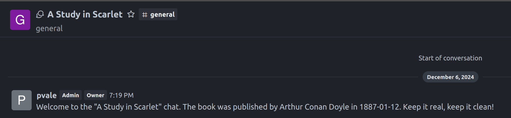

# Experimenting with Rocket Chat

A [Rocket Chat API](https://developer.rocket.chat/apidocs/rocketchat-api) Client to play around.

## Pre-requisites:

- local instance of RocketChat. I
  followed [the Docker approach](https://docs.rocket.chat/docs/deploy-with-docker-docker-compose)
- have an admin user with a _Personal Access Token_ and _User ID_ configured as
  described [here](https://developer.rocket.chat/apidocs/introduction-to-authentication)
    - set them on `bookclub-chat.personal-access-token` and `bookclub-chat.user-id`.

## RocketChat API DTOs

In order to generate the DTOs, I took some definitions
from [the RocketChat OpenAPI Specification](https://github.com/RocketChat/Rocket.Chat-Open-API/tree/main) and used
the [openapi-generator-maven-plugin](https://github.com/OpenAPITools/openapi-generator/tree/master/modules/openapi-generator-maven-plugin).

Configuration can be found on the [pom.xml](rocket-chat-api-sources/pom.xml).

## How to test

From the root folder:

1. Start the application

```shell
mvn install
mvn spring-boot:run -f 
```

1. Make a book creation request

```shell
curl http://localhost:8080/books \
  --header "Content-Type: application/json" \
  -d '{"title":"A Study in Scarlet","author":"Arthur Conan Doyle","publicationDate":"1887-01-12"}'
```

response should return the book with the `id` and most importantly, a new discussion exists for the provided user with
the name of the book and a custom welcome message:

